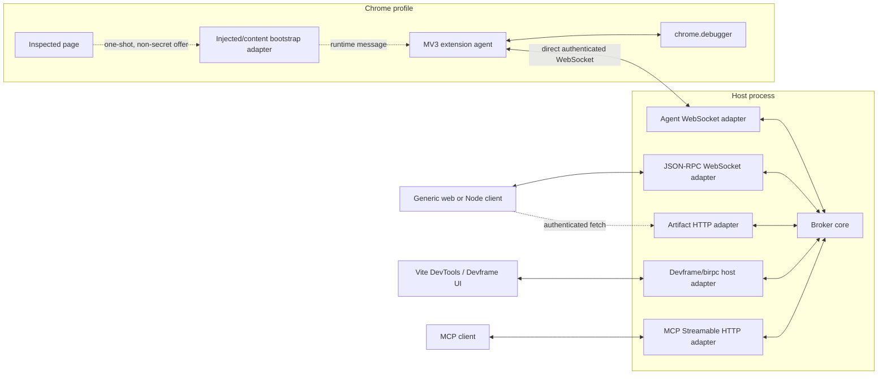
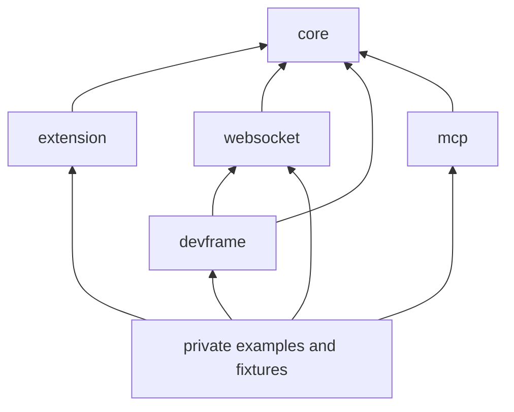

# Chrome Debugger Bridge: Architecture and Implementation Plan

**Prepared:** 2026-08-03
**Status:** Architecture baseline for follow-up refinement
**Scope of this document:** End-state architecture, repository setup, feature contracts, verification strategy, and independently refinable workstreams. It intentionally does not assign releases, milestones, estimates, or execution priority.

## 1. Product definition

Build a set of modular TypeScript primitives that lets any Chrome 125+ Manifest V3 extension expose explicitly authorized `chrome.debugger` targets to one or more consumers.

Consumers may be:

- a Vite DevTools or Devframe integration using `birpc`;
- a generic browser or Node application using JSON-RPC over WebSocket;
- a standalone local application embedding the broker;
- an MCP server using an in-process client and Streamable HTTP at its external boundary;
- a future host or transport implemented through the public adapter contracts.

The package is not a browser automation product, an MCP-specific implementation, or an opinionated extension UI. It is a toolkit of domain primitives, security invariants, and optional adapters.

### 1.1 Non-goals

- Launching, copying, or managing Chrome profiles.
- Hiding Chrome's debugger attachment UI.
- Supporting Manifest V2.
- Supporting Chrome older than 125.
- Treating Firefox or Safari debugging APIs as compatible with `chrome.debugger`.
- Making MCP or `birpc` the canonical domain protocol.
- Relaying CDP traffic through a page, content script, or injected script after bootstrap.
- Letting a broker select arbitrary Chrome tabs using raw Chrome IDs.
- Bundling a required consent UI, target picker, credential store, or host server implementation into the core.
- Defining release order or MVP scope in this document.

## 2. Terminology and responsibilities

| Term | Responsibility | Must not own |
| --- | --- | --- |
| Bridge toolkit | The complete set of published primitives and adapters. | A mandatory deployment topology or UI. |
| Extension agent | Runs inside an MV3 service worker, owns `chrome.debugger`, raw Chrome identifiers, target publication, and final authorization. | Client routing policy or an external server listener. |
| Broker core | Runtime-neutral state machine for agents, opaque targets, clients, leases, subscriptions, routing, and lifecycle. | `chrome.*`, HTTP, WebSocket, MCP, Devframe, files, or UI. |
| Host adapter | Embeds a broker into an existing process and exposes selected transports. | Chrome target authority. |
| Client | Uses the broker's public target, lease, CDP, subscription, and artifact APIs. | Raw Chrome tab, target, window, group, or CDP session IDs. |
| Bootstrap adapter | Carries a non-secret broker connection offer from a page to the extension agent so it can open a direct connection. | Commands, events, artifacts, durable credentials, or the data plane. |
| Transport adapter | Converts messages to and from WebSocket, `birpc`, an in-process channel, or a future transport. | Domain authorization decisions. |
| Policy adapter | Supplies an opinionated choice such as consent UI, exposure selection, metadata redaction, pairing approval, or capability presets. | Bypassing mandatory extension-side checks. |

WebSocket is bidirectional. The broker is required because bidirectionality alone does not provide rendezvous for an outbound-only MV3 service worker, multi-client routing, target identity, leases, authorization, buffering, or lifecycle recovery.

## 3. End-state architecture



### 3.1 Supported deployment topologies

The same broker core must work in all of these topologies:

1. **Embedded Devframe host**
   - A Vite/Devframe plugin mounts the agent WebSocket endpoint on its existing HTTP server.
   - The Devframe UI talks to the host through its existing `birpc` environment.
   - A bootstrap adapter passes the connection offer to the extension.

2. **Standalone host**
   - A Node CLI creates the HTTP/WebSocket listener and embeds the broker.
   - It prints or renders a pairing code/URL.
   - Generic WebSocket and optional MCP endpoints share the host.

3. **Embedded application**
   - Electron, an IDE, or another Node application supplies its own host adapter, credential store, and user interface.
   - It may expose no network-facing client endpoint and call the broker in process.

4. **MCP host**
   - The MCP package embeds or receives a broker instance.
   - MCP tools call an in-process client facade.
   - MCP transport and debugger transport remain independent.

### 3.2 Dependency rule

Dependencies point inward toward domain contracts:



`core` must not import another workspace package. `extension` must not import a Node-only module. `mcp` and `devframe` must not import `chrome.*` implementations.

## 4. Repository and package layout

Use a pnpm 11 workspace with Turbo as the only task graph. Use tsdown for publishable libraries and runtime entry bundles. Use Vite 8 where an application or interactive playground needs a Vite server.

```text
.
├── .github/
│   ├── actions/
│   │   └── setup/
│   └── workflows/
│       ├── ci.yml
│       ├── release.yml
│       └── codeql.yml
├── examples/
│   ├── browser-client/
│   ├── devframe/
│   ├── embedded/
│   ├── extension/
│   ├── mcp/
│   ├── node-client/
│   ├── standalone-host/
│   ├── coverage.json
│   └── README.md
├── packages/
│   ├── core/
│   ├── devframe/
│   ├── extension/
│   ├── mcp/
│   └── websocket/
├── scripts/
│   ├── check-workspace-dependencies.ts
│   └── verify-packed-packages.ts
├── tests/
│   ├── contract/
│   ├── e2e/
│   └── fixtures/
├── eslint.config.ts
├── lerna.json
├── package.json
├── pnpm-workspace.yaml
├── tsconfig.base.json
├── tsconfig.json
├── turbo.json
└── vitest.config.ts
```

The package names below are the proposed naming baseline:

| Directory | Published name | Runtime | Purpose |
| --- | --- | --- | --- |
| `packages/core` | `@dvcol/chrome-debugger-bridge` | Neutral | Protocol types and validation contracts, broker state machine, client facade, policies, errors, and test contracts. |
| `packages/extension` | `@dvcol/chrome-debugger-bridge-extension` | Browser extension | MV3 agent, `chrome.debugger` port, target/session mapping, extension-side security kernel, and bootstrap contracts. |
| `packages/websocket` | `@dvcol/chrome-debugger-bridge-websocket` | Browser and Node subpaths | Direct agent transport, generic client transport, JSON-RPC codec, WebSocket host mounting, heartbeat, reconnect, and binary artifact frames. |
| `packages/devframe` | `@dvcol/chrome-debugger-bridge-devframe` | Browser and Node subpaths | Vite/Devframe host integration, `birpc` facade, and one-shot page/content bootstrap adapters. |
| `packages/mcp` | `@dvcol/chrome-debugger-bridge-mcp` | Node | MCP tools and Streamable HTTP adapter backed by the core client facade. |

Private examples demonstrate composition and remain outside the fixed publication group.

### 4.1 Example coverage

Every public adapter, client, and host composition must have a runnable example. Examples favor minimal composition over product UI and may share fixture pages and test utilities.

| Example | Public surfaces demonstrated |
| --- | --- |
| `examples/extension` | MV3 agent embedding, Chrome debugger port, exposure policy, consent/pairing adapters, bootstrap receiver, and browser WebSocket agent transport. |
| `examples/standalone-host` | Standalone Node broker host, agent/client WebSocket mounting, client authentication, diagnostics, and authenticated artifact HTTP reads. |
| `examples/browser-client` | Generic browser JSON-RPC WebSocket client, target watch, leases, CDP events, cancellation, and artifact fetch. |
| `examples/node-client` | Generic Node JSON-RPC WebSocket client and reconnect/cancellation behavior. |
| `examples/devframe` | Vite/Devframe embedded broker host, `birpc` client facade, connection-offer generation, and one-shot injected/content bootstrap. |
| `examples/mcp` | MCP Streamable HTTP host, semantic tools, raw-CDP escape hatch configuration, artifact mapping, and a sample MCP client. |
| `examples/embedded` | Broker core and client facade in one process using in-memory transport, custom policy adapters, and a custom artifact store without a network client endpoint. |

`examples/coverage.json` maps every exported adapter/client/host factory to at least one example. A repository test validates that the mapped exports exist, every referenced example is a private workspace, and no required public integration surface is omitted.

### 4.2 Export design

Prefer explicit subpath exports over broad barrel files when runtimes differ:

```text
@dvcol/chrome-debugger-bridge
@dvcol/chrome-debugger-bridge/protocol
@dvcol/chrome-debugger-bridge/broker
@dvcol/chrome-debugger-bridge/client
@dvcol/chrome-debugger-bridge/testing

@dvcol/chrome-debugger-bridge-extension
@dvcol/chrome-debugger-bridge-extension/bootstrap
@dvcol/chrome-debugger-bridge-extension/testing

@dvcol/chrome-debugger-bridge-websocket/browser
@dvcol/chrome-debugger-bridge-websocket/node
@dvcol/chrome-debugger-bridge-websocket/testing

@dvcol/chrome-debugger-bridge-devframe/client
@dvcol/chrome-debugger-bridge-devframe/node

@dvcol/chrome-debugger-bridge-mcp
```

All packages are ESM-only, publish declarations and source maps, declare exact export maps, and contain no implicit process startup or global side effects.

## 5. Core package

The core package is a deep, runtime-neutral module. Its public API is organized by cohesive subpaths without splitting every abstraction into a separate npm package.

### 5.1 Domain contracts

Core owns these concepts:

- broker, agent, client, and connection identities;
- protocol versions and negotiated features;
- opaque targets, scopes, sessions, grants, leases, subscriptions, and artifacts;
- capability expressions and command classifications;
- state transitions and lifecycle events;
- transport-neutral request and event payloads;
- structured errors;
- policy and storage ports that are genuinely variable at runtime.

No core type may expose `chrome.tabs.Tab`, `chrome.debugger.Debuggee`, Node request objects, WebSocket objects, MCP types, or `birpc` types.

### 5.2 Schema strategy

- Define each public request, result, notification, and error once.
- Derive static TypeScript types from the runtime definitions rather than maintaining parallel handwritten shapes.
- Expose validators through the Standard Schema interface so Devframe can consume them without making `birpc` canonical.
- Generate or publish JSON Schema artifacts for non-TypeScript client authors.
- Keep the concrete schema library behind core exports; select it during the protocol workstream based on Standard Schema support, JSON Schema output, browser size, and discriminated-union performance.
- Reject unknown protocol envelope fields where ambiguity would weaken security. Domain payloads may opt into forward-compatible unknown fields explicitly.

### 5.3 Transport port

Core consumes a minimal duplex message channel rather than WebSocket directly:

```ts
interface DuplexMessageTransport<InboundMessage, OutboundMessage> {
  readonly incoming: AsyncIterable<InboundMessage>;
  readonly state: TransportState;

  send(message: OutboundMessage): Promise<void>;
  close(reason?: TransportCloseReason): Promise<void>;
}
```

Connection identity and authenticated principal are supplied separately by the host adapter. A transport cannot self-assert permissions.

### 5.4 Broker core

`createBroker()` receives ports for identifiers, time, authorization, artifacts, and diagnostics only where those are real deployment variations.

The broker owns:

- authenticated agent and client registries;
- target and child-session registry;
- target availability state;
- lease acquisition, renewal, expiry, release, and revocation;
- subscription matching, buffering, sequencing, and fan-out;
- command correlation, timeout, cancellation, and late-response disposal;
- per-target CDP domain reference counts;
- artifact descriptors and lifecycle;
- reconnect and stale-generation handling;
- audit events without choosing their storage or presentation.

The broker does not own:

- Chrome attachment;
- exposure selection;
- first-time pairing UI;
- raw Chrome identifiers;
- HTTP or WebSocket listener lifecycle;
- MCP tool definitions;
- durable storage format.

### 5.5 Client facade

Expose one promise/async-iterator API shared by in-process, JSON-RPC, and `birpc` adapters:

```ts
interface ChromeDebuggerBridgeClient {
  getBrokerInfo(): Promise<BrokerInfo>;
  listTargets(filter?: TargetFilter): Promise<PublishedTarget[]>;
  watchTargets(filter?: TargetFilter): AsyncIterable<TargetChange>;

  acquireLease(request: AcquireLeaseRequest): Promise<Lease>;
  renewLease(request: RenewLeaseRequest): Promise<Lease>;
  releaseLease(leaseId: LeaseId): Promise<void>;

  sendCdpCommand(request: CdpCommandRequest): Promise<CdpCommandResult>;
  subscribeToCdp(request: CdpSubscriptionRequest): Promise<CdpSubscription>;
  readArtifact(artifactId: ArtifactId): Promise<ArtifactReader>;
}
```

Do not add high-level browser automation methods to this interface. Semantic helpers and MCP tools compose above it.

## 6. Extension package

### 6.1 Agent facade

The host extension creates an agent and supplies its opinionated adapters:

```ts
const agent = createChromeDebuggerAgent({
  brokerLocator,
  transportFactory,
  exposurePolicy,
  authorizationPolicy,
  pairingPolicy,
  persistence,
  consent,
  diagnostics,
});

await agent.start();
```

These are product ports, not test-only dependency injection seams. The package also supplies safe defaults where a choice is universal, such as cryptographically random opaque IDs and deny-by-default command authorization.

### 6.2 Mandatory security kernel

The following checks are not replaceable:

1. A public target maps to a currently published internal target.
2. The target's grant belongs to the authenticated broker connection.
3. The target and child session generation are current.
4. The requested CDP method is allowed by the target grant.
5. Parameter-sensitive restrictions pass.
6. The response or artifact class is permitted.
7. Revocation, detach, navigation policy changes, or broker loss invalidate the operation.

Adapters may make a policy stricter but cannot bypass these checks.

### 6.3 Raw identifier isolation

The agent is the only module that knows:

- Chrome `tabId`, `windowId`, and `groupId`;
- raw CDP `targetId` and `sessionId` values;
- the relationship between an exposed target and an internal browser object.

It emits random lifecycle-bound public target and session IDs. Closing, revoking, moving outside a selector, or republishing a tab creates a new generation so stale identifiers never regain access.

### 6.4 Physical attachments

- One agent-owned physical `chrome.debugger` attachment exists per exposed root tab.
- Consumers and brokers never attach independently.
- The agent reference-counts functionality required by grants and subscriptions.
- Flat child sessions use Chrome 125+ `DebuggerSession.sessionId` support.
- `Target.setAutoAttach` is recursive: configure each newly attached eligible child session.
- The agent controls Target-domain attachment commands; clients cannot use them to escape the exposed target tree.

### 6.5 Multiple brokers

An agent may maintain connections to multiple paired broker instances so separate host applications can coexist. Each exposure grant belongs to exactly one broker. A root tab cannot be published concurrently to multiple brokers unless a future agent-level cross-broker lease coordinator explicitly supports it.

Reassigning a tab requires revoking its old grant and all dependent leases before publishing a new generation to another broker.

### 6.6 Lifecycle

The agent state machine covers:

```text
stopped -> locating -> connecting -> authenticating -> ready
ready -> reconnecting -> authenticating -> ready
ready -> revoked/stopped
```

Target state covers:

```text
selected -> authorizing -> attaching -> published
published -> detached | revoked | policy-invalid | closed
detached -> explicitly reauthorized -> attaching
```

### 6.7 Published target transition matrix

| Chrome or policy event | Published-target outcome | Authority effect |
| --- | --- | --- |
| Explicitly selected eligible tab | `published` | Creates an opaque target and current generation. |
| Title, URL, or other redacted metadata changes while policy still allows exposure | `updated` | Retains the current generation only. |
| Navigation or metadata refresh makes the selector, grant, or exposure policy invalid | `revoked` with `policy-invalid` | Revokes the current generation before further operations. |
| Tab closes | `revoked` with `closed` | Revokes the current generation and its dependent broker state. |
| Chrome detaches the debugger | `revoked` with `detached` | Revokes the current generation and tolerates the already-detached cleanup race. |
| Agent reconnects | `snapshot` then ordered changes | Reconciles the agent publication set; a lower generation cannot revive a revoked target. |

Persist policy, pairings, and safe configuration. Never persist an assumption that a debugger attachment, child session, lease, subscription, or public target generation survived a service-worker restart.

## 7. Adapter contracts

Every opinionated surface is replaceable behind a narrow adapter.

| Adapter | Input | Output/decision |
| --- | --- | --- |
| `BrokerLocator` | Extension context or bootstrap offer | Candidate broker endpoint and non-secret identity metadata. |
| `BootstrapAdapter` | Page/Devframe connection offer | One-shot delivery to the service worker. |
| `PairingPolicy` | Broker identity, origin, fingerprint, prior pairing | Reject, request user approval, or accept. |
| `PairingStore` | Broker identity and credential material | Persist, rotate, retrieve, and revoke. |
| `ConsentAdapter` | Pairing, exposure, or capability escalation prompt | Explicit user decision. |
| `ExposureSource` | Chrome extension events and host UI actions | Internal selectors to evaluate. |
| `ExposurePolicy` | Selector, tab metadata, broker, incognito state | Publish/revoke decision and maximum capabilities. |
| `TargetMetadataPolicy` | Chrome target metadata | Redacted public metadata. |
| `CommandAuthorizationPolicy` | Grant, method, parameters, session type | Allow or structured denial. |
| `AgentTransportFactory` | Authenticated broker descriptor | Direct duplex connection. |
| `BrokerHostAdapter` | Broker instance and existing server | Mounted agent/client/blob endpoints. |
| `ClientAuthenticationAdapter` | Host-specific request context | Authenticated client principal. |
| `ArtifactStore` | Bytes/stream, metadata, owner, expiry | Opaque descriptor and reader. |
| `DiagnosticsSink` | Structured lifecycle, policy, and audit events | Host-specific logging or UI. |

Adapters are capability-oriented. Avoid broad `platform` objects that leak unrelated APIs through one interface.

## 8. Bootstrap and pairing

### 8.1 Devframe/Vite bootstrap

The content/injected path is used only to establish the direct transport:

1. The Devframe host creates a short-lived connection offer containing endpoint, broker identity, protocol range, nonce, expiry, and optional display metadata.
2. The Devframe page makes that non-secret offer available to its injected bootstrap adapter.
3. The injected adapter sends it to an isolated content script using a one-shot, origin-bound channel.
4. The content script forwards it to the extension service worker through `chrome.runtime` messaging.
5. The service worker validates the offer through `BrokerLocator` and `PairingPolicy`.
6. The extension agent opens its own WebSocket directly to the host.
7. Bootstrap listeners and nonce state are removed. No CDP message uses the page relay.

The offer must not contain a reusable bearer token, raw Chrome ID, client credential, or authority to expose a tab by itself.

### 8.2 Standalone bootstrap

The standalone host may print a pairing code or show a pairing page. That is another `BrokerLocator`/`PairingPolicy` composition, not a separate agent implementation.

### 8.3 Authentication

- WebSocket connections begin unauthenticated and may only exchange bounded handshake messages.
- The host sends a nonce; a paired agent proves possession of its credential without putting the credential in a URL.
- First-time pairing uses a short-lived, one-use code plus explicit policy approval.
- Successful pairing persists broker identity and credential material through the supplied stores.
- Credentials are scoped by role and broker identity, rotatable, and revocable.
- The Node host binds to loopback by default and applies an origin policy appropriate to the adapter.
- Unauthenticated connections have strict byte, message, and time limits.

The exact proof mechanism and credential storage backend are refined in the security workstream. The protocol supports method negotiation rather than hard-coding bearer tokens.

## 9. Protocol model

### 9.1 Domain protocol versus wire codecs

Core defines operations and schemas. Adapters map those operations to their environment:

- JSON-RPC 2.0 is the default interoperable WebSocket codec.
- `birpc` maps the same client facade into Devframe's RPC environment.
- In-process calls invoke the client facade directly.
- MCP maps a curated tool surface to the same facade.

No adapter-specific request object appears in core.

### 9.2 Version negotiation

The first authenticated exchange includes:

- implementation name and version;
- instance ID and role;
- supported protocol version range;
- supported feature identifiers;
- payload and artifact limits;
- heartbeat parameters.

Negotiate one protocol version and feature set. Reject incompatible major versions with a typed error. Minor additions must be feature-gated and backward compatible. Every connection and target publication carries a generation to reject stale traffic.

### 9.3 Agent plane

The default agent/broker protocol covers:

```text
agent.hello
agent.authenticate
agent.resume
agent.ping
agent.goodbye

targets.publish
targets.update
targets.revoke
targets.detached

cdp.execute
cdp.cancel
cdp.configureSubscriptions
cdp.event

artifacts.begin
artifacts.chunk
artifacts.complete
artifacts.abort
```

The broker requests `cdp.execute`; the agent returns the result or a structured error. Agent lifecycle and CDP events are notifications. Artifact chunks may use binary WebSocket frames while retaining typed control messages.

### 9.4 Client plane

The public client protocol covers:

```text
broker.info

targets.list
targets.get
targets.subscribe

leases.acquire
leases.renew
leases.release
leases.list

cdp.send
cdp.subscribe
cdp.unsubscribe

artifacts.get
artifacts.release
```

Notifications include:

```text
targets.published
targets.updated
targets.revoked
targets.detached
leases.expired
leases.revoked
cdp.event
subscriptions.overflow
artifacts.expired
```

### 9.5 Errors

Use stable error codes with optional safe details:

```text
AUTHENTICATION_REQUIRED
AUTHENTICATION_FAILED
PAIRING_REQUIRED
PROTOCOL_VERSION_UNSUPPORTED
FEATURE_UNSUPPORTED
TARGET_NOT_FOUND
TARGET_REVOKED
TARGET_GENERATION_STALE
SESSION_NOT_FOUND
SESSION_GENERATION_STALE
LEASE_REQUIRED
LEASE_CONFLICT
LEASE_EXPIRED
CAPABILITY_DENIED
CDP_METHOD_DENIED
CDP_COMMAND_FAILED
SUBSCRIPTION_OVERFLOW
ARTIFACT_NOT_FOUND
ARTIFACT_EXPIRED
TRANSPORT_CLOSED
```

Never forward raw exception objects or Chrome errors containing internal identifiers. Preserve a safe Chrome error message and method context when useful.

## 10. Targets, scopes, and exposure

### 10.1 Public model

```ts
interface PublishedTarget {
  id: TargetId;
  generation: number;
  scopeId: ScopeId;
  title?: string;
  url?: string;
  type: PublicTargetType;
  capabilities: CapabilityGrant;
  availability: TargetAvailability;
}
```

Metadata is optional because a policy may redact title, URL, favicon, or child information.

### 10.2 Selector primitives

Core extension contracts accommodate:

```ts
type ExposureSelector =
  | { type: 'tab'; tabId: number }
  | { type: 'explicit-set'; tabIds: number[] }
  | { type: 'group'; groupId: number }
  | { type: 'window'; windowId: number }
  | { type: 'active-tab' }
  | { type: 'url-pattern'; patterns: string[] };
```

These types are internal to the extension package because they contain Chrome IDs. Public clients only see opaque scopes and targets.

Every relevant Chrome event re-evaluates selectors. Leaving a group/window/pattern, entering an unauthorized incognito context, closing, or manual revocation removes access immediately.

### 10.3 Exposure authority

- Exposure is user- or host-extension-driven by default.
- An unprivileged client cannot publish a target.
- A privileged management adapter may request exposure, but the extension policy and consent adapters remain authoritative.
- Unsupported pages are not published.
- Incognito is denied by default and requires a separate policy decision.

## 11. Capabilities and CDP policy

Scope answers **which target**; capability answers **what may be done**.

### 11.1 Capability vocabulary

Core supports named capability presets and a compiled grant:

```ts
interface CapabilityGrant {
  preset?: 'observe' | 'inspect' | 'interact' | 'debug' | 'full';
  domains?: readonly string[];
  methods?: readonly string[];
  deniedMethods?: readonly string[];
  artifacts?: readonly ArtifactClass[];
  expiresAt?: string;
}
```

Presets are adapter conveniences. The compiled method/artifact grant is authoritative.

### 11.2 Command classification

Maintain a reviewed CDP policy catalogue for Chrome's allowed debugger domains:

- observe: events and non-sensitive metadata;
- inspect: DOM snapshots, runtime inspection, response bodies, accessibility, and similar reads;
- interact: navigation, input, DOM mutation, emulation, and form actions;
- debug: breakpoints, profiling, tracing, Fetch interception, and related stateful operations;
- raw: unknown or explicitly unclassified supported CDP methods.

Unknown methods are denied unless the grant includes the trusted raw capability. Parameter-aware checks prevent Target-domain escape, attachment to unrelated targets, unrestricted download behavior, or other cross-target effects.

The extension validates the compiled target grant on every command even when the broker has already validated the client's lease.

## 12. Leases and multi-client behavior

The broker arbitrates clients sharing one agent-owned attachment.

```ts
type LeaseMode = 'shared-read' | 'exclusive-control';
```

Lease properties:

- authenticated owner;
- opaque target and generation;
- capability subset bounded by the target grant;
- mode;
- issued, expiry, and renewal timestamps;
- explicit status and revocation reason.

Rules:

- Multiple compatible shared-read leases may coexist.
- Only one exclusive-control lease may exist for a target.
- Read observers may remain while a controller operates unless exposure policy selects private control.
- Mutating or unknown raw commands require exclusive control.
- Read-only CDP methods may use a shared-read lease according to the command catalogue.
- A client cannot request capabilities above the target grant.
- Disconnect starts the configured expiry/grace behavior; it does not create a permanent implicit claim.
- Target revocation, generation change, detach, agent loss, or policy reduction immediately revokes affected leases.
- Human interaction is never blocked. It may invalidate automation assumptions, but the bridge does not attempt to seize browser input.

## 13. Events, subscriptions, and domain coordination

### 13.1 Subscription filters

Subscriptions may filter by:

- target and generation;
- public child session;
- domain;
- exact method or method prefix;
- optional safe predicates;
- buffer size;
- batch size and flush interval;
- overflow strategy.

### 13.2 Backpressure

Each delivered event has a monotonically increasing subscription sequence. Overflow behavior is explicit:

```ts
type OverflowStrategy = 'drop-oldest' | 'drop-newest' | 'disconnect';
```

Overflow notifications report the dropped count and last delivered sequence. Apply stricter limits to tracing, profiling, Fetch interception, and other high-volume/stateful domains.

### 13.3 CDP domain reference counts

The broker calculates aggregate demand; the extension applies it safely:

```text
first Network subscriber -> Network.enable
additional subscriber -> increment only
subscriber leaves -> decrement
last subscriber leaves -> policy may call Network.disable
```

The agent, not clients, owns automatic enable/disable calls. Explicit client calls that conflict with coordinated state are rejected or virtualized.

## 14. Artifacts

Screenshots, traces, heap/profile output, and large response bodies use an artifact abstraction.

```ts
interface ArtifactDescriptor {
  id: ArtifactId;
  mediaType: string;
  byteLength?: number;
  sha256?: string;
  expiresAt: string;
}
```

Rules:

- The public descriptor contains no filesystem path.
- Ownership and target grant are checked when reading.
- WebSocket adapters may stream binary frames keyed by artifact ID.
- Host adapters may expose authenticated short-lived HTTP reads.
- Credentials never appear in artifact URLs.
- Stores enforce byte limits, expiry, cancellation, and deletion.
- Small JSON-safe CDP results may remain inline below a negotiated threshold.

The broker depends only on `ArtifactStore`; memory, filesystem, and host-managed implementations remain adapters.

## 15. WebSocket package

### 15.1 Browser side

- Use the platform `WebSocket` implementation.
- Connect outbound from the MV3 service worker.
- Send heartbeat traffic within Chrome's service-worker activity window.
- Apply bounded exponential backoff with jitter.
- Re-run authentication and state reconciliation after reconnect.
- Never place reusable credentials in the URL.

### 15.2 Node side

- Mount onto an existing HTTP server or create a standalone listener through separate functions.
- Use separate default paths for agent and generic client roles.
- Reject role confusion during handshake.
- Bind standalone defaults to `127.0.0.1` and optionally `::1`, never `0.0.0.0` implicitly.
- Validate request origin through a host-supplied policy.
- Enforce handshake timeouts, maximum frame sizes, queue limits, and idle expiry.

Suggested configurable default paths:

```text
/cdb/agent
/cdb/client
/cdb/artifacts/:id
```

### 15.3 Contract tests

Run the same transport behavior suite against:

- in-memory duplex transport;
- browser-to-Node WebSocket;
- generic JSON-RPC client WebSocket;
- Devframe `birpc` facade.

## 16. Devframe package

Use Vite DevTools and Devframe as integration references while retaining the bridge's own domain boundary.

### 16.1 Node adapter

Provide a composable integration that:

- receives an existing Devframe/Vite server;
- creates or receives a broker instance;
- mounts the agent WebSocket path;
- registers a typed `birpc` facade backed by the core client;
- generates short-lived connection offers for inspected pages;
- exposes lifecycle and diagnostics to the Devframe host;
- disposes routes, connections, and broker resources with the host.

### 16.2 Client adapter

Provide typed client helpers for:

- listing and watching targets;
- acquiring/releasing leases;
- executing CDP calls;
- consuming event streams with cancellation;
- resolving artifacts;
- initiating the one-shot extension bootstrap.

`birpc` streaming conventions are isolated here. The bridge protocol remains usable without Devframe.

### 16.3 Bootstrap entries

Build content and injected entries separately. The page-world entry is a small IIFE with no Node imports and no broker/client implementation. The content entry runs in the isolated world and forwards only validated, expiring connection offers.

## 17. MCP package

The MCP adapter uses the official TypeScript SDK version current when this workstream is refined. Protocol-version-specific behavior remains inside this package.

### 17.1 Tool surface

Expose a compact semantic set rather than one tool per CDP method:

```text
browser.list_targets
browser.acquire
browser.renew
browser.release

browser.snapshot
browser.navigate
browser.click
browser.type
browser.press
browser.evaluate
browser.screenshot
browser.console
browser.network
browser.network_body
browser.wait_for

browser.cdp
```

`browser.cdp` is an explicit trusted escape hatch and is disabled by safer presets.

### 17.2 Boundary rules

- MCP does not own the extension, broker, target registry, lease state, or Chrome lifecycle.
- Tools receive a core client or broker factory.
- Map MCP cancellation to client operation/subscription cancellation.
- Resolve artifacts through SDK resource/content facilities without unbounded base64 expansion.
- Use Streamable HTTP for network clients and provide stdio only as a thin adapter when required.
- Negotiate the stable MCP protocol versions supported by the chosen SDK; do not leak MCP protocol changes into core.

## 18. Build configuration

### 18.1 Runtime baseline

- Node.js 24 or newer for Node packages, tooling, and CI.
- Chrome 125 or newer for the extension runtime.
- pnpm 11, pinned exactly in the root `packageManager` field.
- TypeScript, Vite, tsdown, Turbo, Vitest, and ESLint versions centralized in named catalogs.
- Vitest, `@vitest/browser-playwright`, and `@vitest/coverage-v8` stay on the same latest stable release line. At the time of this plan that line is 4.1.10; refresh the three together when scaffolding begins.
- `jsdom` and Playwright use their latest compatible stable versions from the testing catalog.

### 18.2 tsdown

Model package builds after Vite DevTools' runtime split:

- `core`: neutral ESM, declarations, source maps, multiple subpath entries.
- `extension`: browser ESM library entries; test utilities in a separate export.
- `websocket`: separate neutral/browser and Node builds so Node dependencies cannot enter browser output.
- `devframe`: separate client, Node, content, and injected builds; injected output uses IIFE.
- `mcp`: Node ESM and declarations.

Set package exports from build entries and validate them with `publint`. Bundle only code that must be self-contained for the extension bootstrap; keep ordinary library dependencies external unless package analysis proves inlining is required.

### 18.3 Vite 8

Use Vite 8 for interactive examples:

- Devframe example;
- generic browser-client example;
- any reference extension popup/options UI;
- inspector or protocol viewer.

The extension library itself must not require Vite, WXT, or another extension framework. The plain MV3 example proves framework-independent embedding.

## 19. pnpm workspace and dependency policy

`pnpm-workspace.yaml` is the only external dependency-version authority.

```yaml
catalogMode: strict
cleanupUnusedCatalogs: true
disallowWorkspaceCycles: true
saveWorkspaceProtocol: true
shellEmulator: true
trustPolicy: no-downgrade

packages:
  - packages/*
  - examples/*
  - tests/fixtures/*

catalogs:
  build: {}
  devtools: {}
  protocol: {}
  release: {}
  runtime: {}
  testing: {}
  types: {}
```

Manifest policy:

- Every external dependency in `dependencies`, `devDependencies`, `peerDependencies`, and `optionalDependencies` uses `catalog:<name>`.
- Published-package internal runtime, peer, and optional dependencies use `workspace:^`.
- Internal development dependencies use `workspace:*`.
- Private apps use `workspace:*` for internal packages because no registry range is published.
- Literal external versions exist only in `pnpm-workspace.yaml`.
- Root `packageManager`, `engines`, and each package's own `version` are valid literal exceptions.
- Link/file dependencies are limited to isolated publication-test fixtures outside normal package manifests.

### 19.1 ESLint enforcement

Use `@dvcol/eslint-config`, enabling the pnpm integration inherited from `@antfu/eslint-config`:

```ts
export default defineTypescriptConfig(
  {
    pnpm: {
      catalogs: true,
      sort: true,
    },
    type: 'lib',
  },
  {
    files: ['package.json', '**/package.json'],
    rules: {
      'pnpm/json-enforce-catalog': [
        'error',
        {
          allowedProtocols: ['workspace'],
          conflicts: 'error',
          fields: [
            'dependencies',
            'devDependencies',
            'optionalDependencies',
            'peerDependencies',
          ],
        },
      ],
    },
  },
);
```

Retain the inherited catalog validation, workspace-settings, duplicate-catalog, and unused-catalog rules. Enable the no-anonymous-catalog rule if all dependencies are assigned to named catalogs.

`scripts/check-workspace-dependencies.ts` performs only the policy ESLint cannot infer: whether a dependency name is an internal workspace package and therefore must use the correct `workspace:^` or `workspace:*` form.

## 20. Turbo task graph

Root commands invoke Turbo; packages expose small local commands.

```json
{
  "tasks": {
    "build": {
      "dependsOn": ["^build"],
      "outputs": ["dist/**"]
    },
    "dev": {
      "cache": false,
      "persistent": true
    },
    "lint": {
      "outputs": [".eslintcache"]
    },
    "typecheck": {
      "dependsOn": ["^typecheck"],
      "outputs": []
    },
    "test": {
      "dependsOn": ["^build"],
      "outputs": ["coverage/**"]
    },
    "test:browser": {
      "dependsOn": ["build"],
      "outputs": ["__traces__/**", "coverage/browser/**"]
    },
    "test:e2e": {
      "dependsOn": ["build"],
      "cache": false,
      "outputs": ["test-results/**"]
    },
    "check:workspace": {
      "outputs": []
    },
    "pack": {
      "dependsOn": ["build"],
      "outputs": ["artifacts/packages/**"]
    },
    "verify:pack": {
      "dependsOn": ["pack"],
      "outputs": []
    }
  }
}
```

Refine exact cache inputs with package configuration. The root lockfile and shared TypeScript/ESLint/tsdown configuration invalidate relevant tasks. Do not introduce full Lerna, `@lerna-lite/run`, Nx, or another task graph. Lerna-Lite is limited to its modular version/publish flow.

## 21. Testing strategy

### 21.1 Vitest projects and environments

Use the latest stable Vitest across the repository with named projects and explicit environment ownership:

| Project | Environment/provider | Applies to |
| --- | --- | --- |
| `unit-node` | Vitest `node` | Core state machines, broker, Node WebSocket host, MCP, filesystem artifacts, release/package scripts. |
| `unit-jsdom` | Vitest `jsdom` | Fast DOM-facing client/bootstrap units that need `window`, `document`, events, or `postMessage` semantics but not a real browser engine. |
| `browser-chromium` | Vitest Browser Mode with `@vitest/browser-playwright` | Native browser WebSocket, Web Crypto, streams, DOM events, injected bootstrap behavior, browser client, and interactive example UI. |
| `extension-e2e` | Vitest Node project orchestrating Playwright's Chromium persistent context | Built MV3 extension, service worker, `chrome.debugger`, side-loaded extension lifecycle, and end-to-end host/client topology. |
| `package-consumers` | Vitest `node` plus spawned clean fixtures | Packed tarballs, export maps, type consumers, and local-registry publication. |

Keep Vitest, `@vitest/browser-playwright`, and coverage packages version-aligned in the testing catalog. Configure Browser Mode with one Chromium instance, real Playwright actions, CI headless mode, and traces retained on failure.

Use jsdom only when its simulated platform is the intended test boundary. Any assertion depending on native WebSocket behavior, browser security boundaries, focus/input, layout, Web Crypto, or real page messaging belongs in Browser Mode.

MV3 extension E2E remains a Vitest project but uses Playwright's `chromium.launchPersistentContext()` from the Node side because extension loading and service-worker inspection require browser-context control. Do not force that orchestration into a browser test iframe merely for uniformity.

### 21.2 Unit tests

Test pure state machines and policies for:

- target generations and revocation;
- broker/agent reconnect reconciliation;
- lease compatibility, expiry, renewal, and conflicts;
- subscription matching, sequencing, batching, and overflow;
- CDP capability and parameter classification;
- child-session mapping and inheritance;
- command cancellation and late results;
- artifact limits and expiry;
- protocol validation and error redaction.

Use exact `expect.assertions(N)` counts in Vitest. Mock real module/I/O boundaries rather than adding test-only factories to production APIs.

### 21.3 Contract tests

Publish reusable contract suites from testing subpaths:

- `DuplexMessageTransport` behavior;
- agent transport authentication/reconnect;
- client facade parity across in-process, JSON-RPC, and `birpc`;
- `ArtifactStore` behavior;
- persistence and credential-store behavior;
- adapter cleanup and cancellation.
- example coverage-manifest completeness.

### 21.4 Chrome end-to-end tests

Use an isolated temporary Chromium profile only for tests. Load the plain MV3 example and exercise a real `chrome.debugger` connection against local fixtures.

Cover:

- one-shot bootstrap followed by direct WebSocket traffic;
- explicit target publication and opaque IDs;
- CDP command/response and unsolicited events;
- out-of-process iframe and worker flat sessions;
- multiple observers and one exclusive controller;
- immediate revocation and stale-ID rejection;
- DevTools-triggered detach behavior where automatable;
- service-worker suspension/restart and reconnect;
- navigation, tab close, group/window movement, and policy change;
- WebSocket interruption and broker restart;
- screenshots and large artifacts;
- denial of unexposed targets and forbidden methods.

Playwright is a test harness only and is never a product runtime dependency.

### 21.5 Interoperability tests

- Install packed packages into clean consumers.
- Compile a TypeScript consumer against each public subpath.
- Run a browser client without workspace source aliases.
- Exercise the Devframe `birpc` integration.
- Exercise the MCP adapter with the official SDK test client/inspector.
- Exercise JSON-RPC from a non-TypeScript fixture using generated JSON Schema.
- Build and smoke-test every private example against packed packages rather than workspace source aliases in at least one CI job.

### 21.6 Package tests

For every public package:

1. Build with tsdown.
2. Run `publint`.
3. Run `pnpm pack`.
4. Inspect the tarball file list and `package.json`.
5. Assert no `catalog:` or `workspace:` specifier escaped.
6. Install tarballs into a clean consumer.
7. Import every documented export under its intended runtime.

## 22. CI and publication

Use the current dvcol templates for workflow structure and immutable action pinning, Vite DevTools for monorepo checks, and `neo-svelte` for the current Node/pnpm/TypeScript baseline.

### 22.1 Pull requests

- Checkout and setup actions pinned to commit SHAs.
- Node 24 and the exact root pnpm version.
- `pnpm install --frozen-lockfile`.
- Workspace dependency-policy check.
- Turbo lint, typecheck, unit tests, and builds.
- Vitest Browser Mode tests in Chromium through the Playwright provider, with failure traces uploaded as artifacts.
- Chromium end-to-end tests.
- Build and smoke-test every example; validate `examples/coverage.json` against public integration exports.
- Packed-package verification.
- Conventional Commit validation for the history used to calculate releases.
- Optional OS matrix for Node-neutral packages; Chrome E2E may remain Linux-only unless platform behavior requires more.

### 22.2 Publishing

Use Lerna-Lite's modular release packages, not full Lerna:

- install only `@lerna-lite/cli` and `@lerna-lite/publish`; the publish package supplies version support;
- keep fixed mode in `lerna.json` and run with `--force-publish "*"` so every public package remains on the same version;
- derive bumps and changelogs from Conventional Commits, matching the existing dvcol release style;
- let Lerna-Lite transform named `catalog:` and `workspace:` references in its temporary publication manifests;
- publish with npm trusted publishing and provenance, with `id-token: write` isolated to the release job;
- create synchronized tags and the GitHub release after the full verification graph succeeds;
- use `from-git` or `from-package` to retry a partial publication safely.

Before enabling the registry workflow, run the actual Lerna-Lite fixed-mode release against a local registry, inspect every published tarball, install the five-package set into a clean consumer, and prove that `--force-publish "*"` advanced the entire train.

See [publishing-research.md](./publishing-research.md) for the Lerna/Lerna-Lite/Changesets comparison and publication guard.

## 23. Diagnostics and observability

Emit structured events from core and extension boundaries:

- connection and authentication lifecycle;
- pairing and revocation;
- target publish/update/revoke/detach;
- lease acquire/renew/release/expire/conflict;
- command accepted/denied/failed with safe method metadata;
- subscription overflow;
- artifact create/read/expire;
- service-worker and broker recovery.

Never log credentials, raw Chrome IDs, sensitive command parameters, response bodies, page content, or artifact bytes by default.

Node-only reference hosts follow the repository logging convention: direct `console.*` calls at the emit site, `styleText` from `node:util`, an emoji marker, and split arguments. Browser libraries emit diagnostics through the adapter rather than writing to the console implicitly.

## 24. Feature catalogue

This catalogue is intentionally unprioritized. Each group can be refined into its own specification and issue set later.

### Repository and distribution

- pnpm workspace and named catalogs.
- Turbo task graph and shared commands.
- tsdown multi-runtime builds.
- Vite 8 playgrounds.
- strict export maps, declarations, source maps, `publint`.
- Lerna-Lite fixed release train and trusted publishing.
- packed-package and clean-consumer verification.

### Protocol and compatibility

- Standard Schema-compatible runtime validation.
- generated JSON Schema.
- version and feature negotiation.
- JSON-RPC codec.
- stable error taxonomy.
- cancellation, timeouts, generations, and idempotency rules.

### Agent lifecycle

- broker discovery and direct outbound connection.
- first-time pairing and persistent identity.
- multiple paired broker connections.
- heartbeat, reconnect, resume, and service-worker restart.
- safe persistence and explicit revocation.

### Exposure and target lifecycle

- explicit tab selector.
- explicit set, group, window, active-tab, and URL-pattern selectors.
- metadata redaction.
- incognito and unsupported-target policy.
- opaque IDs and target generations.
- dynamic publish/revoke on Chrome events.

### Debugger lifecycle

- attach/detach and DevTools conflict handling.
- raw CDP command routing.
- child targets and recursive flat sessions.
- navigation/context invalidation.
- coordinated CDP domains.
- command cancellation and timeout.

### Security and authorization

- mandatory extension-side security kernel.
- target grants and capability presets.
- method/parameter CDP catalogue.
- response/artifact classification.
- privileged exposure-management adapter.
- credential rotation and audit events.

### Broker and multi-client behavior

- agent/client registries.
- shared-read and exclusive-control leases.
- renewal, expiry, grace, and revocation.
- subscription filters and fan-out.
- event sequencing, batching, and overflow.
- target availability/reconciliation.

### Artifacts

- inline-size threshold.
- binary WebSocket streaming.
- memory and filesystem stores.
- authenticated HTTP retrieval.
- integrity, quotas, expiry, and cleanup.

### Consumers and integrations

- transport-neutral TypeScript client.
- generic browser/Node JSON-RPC WebSocket client.
- Devframe host and `birpc` client adapters.
- Vite connection-offer/bootstrap adapter.
- standalone host composition.
- MCP Streamable HTTP adapter and semantic tools.
- optional thin stdio MCP adapter.
- diagnostic inspector/playgrounds.

### Examples and test environments

- runnable extension-agent example.
- standalone and embedded broker-host examples.
- browser and Node generic-client examples.
- Devframe host/client/bootstrap example.
- MCP host/client example.
- machine-validated example coverage manifest.
- latest stable Vitest Node and jsdom projects.
- Vitest Browser Mode with the Playwright Chromium provider.
- Playwright persistent-context MV3 E2E orchestrated by Vitest.

## 25. Independently refinable workstreams

These are architectural slices, not priority order or release assignments.

| Workstream | Owns | Required outputs for refinement |
| --- | --- | --- |
| Repository foundation | pnpm, catalogs, Turbo, tsdown, TypeScript, ESLint, Vitest, CI skeleton | Exact manifests, task graph, shared configs, dependency-policy contract. |
| Protocol and schemas | Domain payloads, versioning, errors, JSON Schema | Protocol specification, schema-library decision, compatibility rules, fixtures. |
| Broker domain | Registries, targets, leases, subscriptions, routing, reconciliation | State machines, concurrency rules, port interfaces, invariant tests. |
| Extension agent | `chrome.debugger`, mappings, security kernel, lifecycle | Agent API, Chrome event matrix, policy interfaces, permission/manifest requirements. |
| Pairing and bootstrap | discovery offers, content/injected adapter, credentials | Threat model, handshake transcript, identity storage, consent states. |
| WebSocket transport | browser/Node endpoints, JSON-RPC, reconnect, binary frames | Frame formats, endpoint mounting API, limits, transport contract suite. |
| CDP policy | capability presets, method/parameter classification | Generated/reviewed catalogue, unknown-method behavior, restricted-domain tests. |
| Artifacts | descriptors, stores, streaming, HTTP | Store contract, quota/expiry policy, binary framing, authorization. |
| Devframe integration | Vite host, `birpc`, page bootstrap | Plugin lifecycle, RPC facade, offer injection, cleanup, playground. |
| MCP integration | tools, Streamable HTTP, stdio compatibility | Tool schemas, lease behavior, cancellation, artifact mapping, SDK compatibility. |
| Examples | every public adapter, client, and host composition | Runnable private workspaces, coverage manifest, concise READMEs, smoke tests against packed packages. |
| End-to-end verification | real extension/Chrome and clean consumers | Test topology, fixtures, browser matrix, security and recovery scenarios. |
| Publication | Lerna-Lite version/publish, trusted publishing, tarball validation | Fixed-mode config, force-publish invariant, release workflow, local registry proof, rollback procedure. |

Every workstream refinement must preserve the dependency direction and security invariants in this document. New opinionated behavior belongs in an adapter unless it is required to keep the extension-side authority sound.

## 26. Cross-workstream acceptance criteria

The architecture is realized when all of the following are true:

1. An arbitrary Chrome 125+ MV3 extension can import the extension package, supply its own adapters/UI, and expose a selected tab.
2. Bootstrap through a content/injected adapter ends after the service worker establishes its direct WebSocket.
3. No page script, broker, or client receives a raw Chrome tab/window/group/session ID.
4. A host can embed the broker in Devframe, a standalone Node server, or an application without changing core.
5. Vite DevTools can use a `birpc` adapter while a generic web client uses JSON-RPC WebSocket against the same broker state.
6. An MCP adapter can call the same broker in process without owning Chrome lifecycle.
7. Multiple readers can observe one target and one controller can hold exclusive mutation rights.
8. The extension rejects a broker command outside the target's grant even if broker-side validation is bypassed.
9. Target revocation invalidates leases, sessions, subscriptions, queued commands, and artifact access immediately.
10. Chrome service-worker restart, broker restart, navigation, child targets, DevTools detach, and transport interruption have explicit tested outcomes.
11. Large results flow through bounded artifacts rather than unbounded JSON/base64 messages.
12. Every external dependency version is centralized in a pnpm catalog and every internal reference uses `workspace:`.
13. Every public package packs into a registry-compatible tarball with no workspace-only specifier remaining.
14. Public packages share one version and can be published through the validated Lerna-Lite fixed-mode flow without unresolved dependency protocols.
15. Every exported adapter, client, and host factory is mapped to a runnable, documented, CI-smoke-tested example.
16. Tests use the latest aligned Vitest line with Node/jsdom environments and Playwright-backed Browser Mode where the real browser platform is the tested boundary.

## 27. Decisions fixed by this planning session

- Chrome 125+; no legacy debugger-session fallback.
- pnpm workspace and Turbo command graph.
- tsdown for libraries; Vite 8 for interactive applications.
- named pnpm catalogs and `workspace:` references enforced everywhere.
- `@dvcol/eslint-config` pnpm rules as the main manifest policy gate.
- modular Lerna-Lite version/publish fixed release train; no full Lerna, Lerna-Lite task runner, or Nx layer.
- runtime-boundary packages: core, extension, WebSocket, Devframe, and MCP.
- broker is embeddable core, not necessarily a standalone daemon.
- WebSocket is the direct extension data transport and is bidirectional.
- `birpc` is a Devframe adapter, not the canonical public protocol.
- content/injected messaging is a bootstrap adapter only.
- all opinionated integration surfaces are adapters.
- extension-side target/capability authorization is mandatory and deny-by-default.
- raw Chrome identifiers never cross the extension boundary.
- all public packages use a single fixed version train.
- every public adapter, client, and host composition ships with a runnable example.
- latest stable Vitest with jsdom and Playwright-backed Browser Mode is the repository test baseline.

## 28. Matters intentionally deferred to workstream refinement

These do not change the architecture and can be decided independently:

- concrete Standard Schema-compatible validation library;
- exact cryptographic pairing proof and default credential-store implementations;
- exact package and endpoint names before first publication;
- detailed CDP method and parameter capability catalogue;
- default selector/consent UI shipped by examples;
- artifact inline threshold, quotas, and default backing store;
- exact MCP SDK/spec compatibility window;
- exact Lerna-Lite release flags and direct-release versus release-PR workflow mechanics;
- release contents, task priority, estimates, milestones, and ownership.

## 29. Primary references

- [Cursory project research](./chrome-debugger-bridge-research.md)
- [Publishing research](./publishing-research.md)
- [Chrome debugger API](https://developer.chrome.com/docs/extensions/reference/api/debugger)
- [Chrome MV3 service-worker WebSockets](https://developer.chrome.com/docs/extensions/how-to/web-platform/websockets)
- [Vite DevTools monorepo](https://github.com/vitejs/devtools)
- [Devframe](https://github.com/devframes/devframe)
- [dvcol ESLint configuration](https://github.com/dvcol/eslint-config)
- [Antfu pnpm ESLint rules](https://github.com/antfu/eslint-config/blob/main/src/configs/pnpm.ts)
- [Vitest Browser Mode](https://vitest.dev/guide/browser/)
- [Vitest Playwright provider](https://vitest.dev/config/browser/playwright)
- [Playwright Chrome extension testing](https://playwright.dev/docs/chrome-extensions)
- [pnpm catalogs](https://pnpm.io/catalogs)
- [pnpm workspace protocol](https://pnpm.io/workspaces#workspace-protocol-workspace)
- [Lerna-Lite](https://github.com/lerna-lite/lerna-lite)
- [dvcol web extension template](https://github.com/dvcol/web-extension-template)
- [dvcol neo-svelte](https://github.com/dvcol/neo-svelte)
